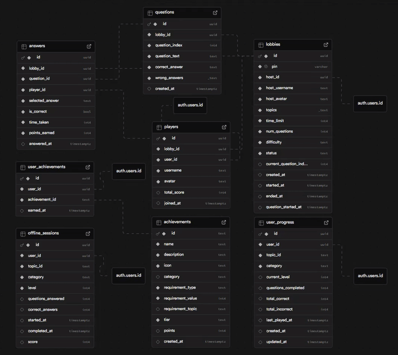
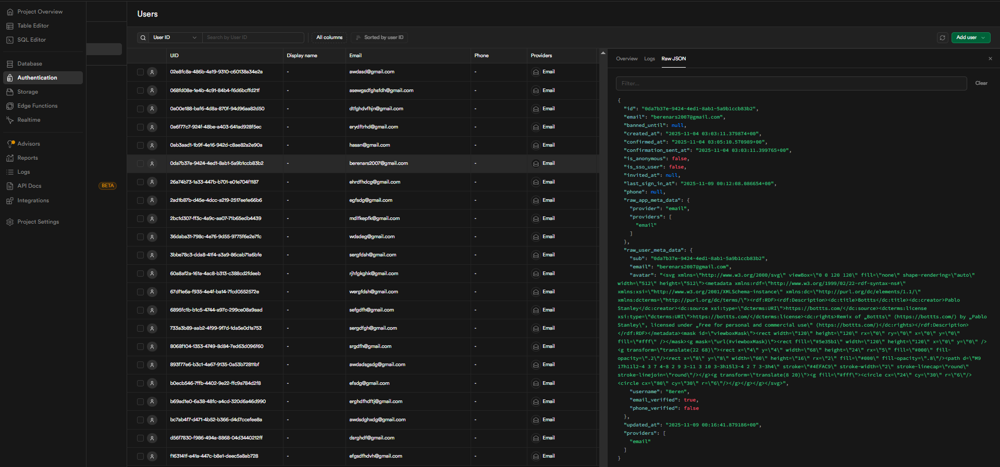
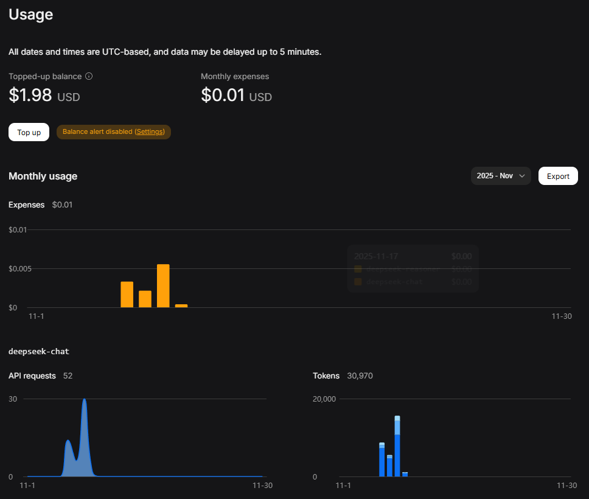

#  CodeIQ

> **An AI-Powered Computer Science Quiz Platform with Real-Time Multiplayer**

CodeIQ is a full-stack mobile and web application that transforms CS education into an engaging, competitive experience. Combining AI-generated questions, real-time multiplayer lobbies, and comprehensive progress tracking, CodeIQ helps students master computer science fundamentals through gamified learning.

[](https://reactnative.dev/)
[](https://expo.dev/)
[](https://www.typescriptlang.org/)
[](https://supabase.com/)


## 📱 Overview

CodeIQ is a cross-platform educational app designed to help students master computer science topics through:
- **🤖 AI-Generated Questions**: Every quiz is unique, powered by DeepSeek AI
- **⚡ Real-Time Multiplayer**: Kahoot-style competitive lobbies with live scoring
- **📊 Progress Tracking**: 50 levels per topic with achievements and statistics
- **🎯 16 Specialized Topics**: CS, ML, Computer Engineering, and Cybersecurity
- **🌐 Cross-Platform**: Runs on iOS, Android, and Web with a single codebase

**Perfect for**: CS students, coding bootcamp participants, technical interview prep, and competitive learning environments.

---

### Demo

# Watch full demo on Youtube → [Watch](https://youtu.be/RMbVbJ64PQg)
---

### 🎨 Modern UI/UX

- **Dual Theme Support**: Automatic light/dark mode
- **Smooth Animations**: Podium reveals, transitions, progress bars
- **Responsive Design**: Optimized for all screen sizes
- **Haptic Feedback**: Touch responses on mobile
- **Custom Components**: SVG avatars, themed text, collapsible sections
- **Accessibility**: High contrast, clear typography, touch-optimized

# CodeIQ UI → [View UI](https://www.figma.com/design/v08xdXFA81C2rqdEJpkUmj/CodeIQ-UI?m=auto&t=K4RHTafWiwuNEsdA-1)

---
### 🎮 Dual Game Modes

#### **Offline Practice Mode**
- Solo learning experience with 16 specialized topics across 4 categories
- **4 CS Topics**: Algorithms & Data Structures, Theory & Concepts, Programming Logic, CS Trivia
- **4 ML Topics**: Core Concepts, Algorithms & Math, Applied ML, AI History & Tools
- **4 CE Topics**: Digital Logic & Circuits, Computer Architecture, Embedded Systems, Hardware Trivia
- **4 Security Topics**: Network Security, Ethical Hacking, Cryptography, Security Awareness
- 50 progressive levels per topic with increasing difficulty
- AI generates 8 unique questions per level
- Persistent progress tracking and statistics

#### **Online Multiplayer Mode**
- Host or join lobbies with 5-digit PIN codes
- 2-30 questions per game, customizable time limits (5-35 seconds)
- Real-time scoring with speed bonuses (1000-1500 points per question)
- Live leaderboard updates after each question
- Animated podium reveal for final rankings
- Synchronized gameplay across all devices
---
### 🏆 Comprehensive Achievement System

14 built-in achievement:
- **Level Milestones**: First Steps (Level 1) → Master Scholar (Level 50)
- **Question Volume**: Curious Mind (100 questions) → Trivia Titan (1000 questions)
- **Category Mastery**: CS Enthusiast, ML Explorer, Hardware Guru, Security Expert
- **Perfect Scores**: Perfectionist → Flawless Master

```typescript
// Automatic achievement detection
export async function checkAndAwardAchievements(
  topicId: string,
  level: number,
  correctAnswers: number
): Promise<Achievement[]> {
  const newAchievements: Achievement[] = [];
  const allAchievements = await getAllAchievements();
  const userProgress = await getAllUserProgress();
  
  for (const achievement of allAchievements) {
    if (shouldAwardAchievement(achievement, userProgress, level)) {
      await awardAchievement(achievement);
      newAchievements.push(achievement);
    }
  }
  
  return newAchievements;
}
```

### 🔐 Robust Authentication System

- Email/password authentication with Supabase Auth
- Google OAuth integration (ready for deployment)
- Persistent sessions with auto-refresh tokens
- Real-time user metadata synchronization
- 20 customizable robot avatars
- Editable usernames with instant sync

### 📊 Real-Time Synchronization

Built on Supabase Realtime for instant updates:
- Lobby player joins/leaves
- Question transitions in multiplayer
- Live score updates and leaderboard
- Achievement unlocks
- Progress synchronization across devices

```typescript
// Real-time lobby subscription
supabase
  .channel(`lobby:${lobbyId}`)
  .on('postgres_changes', {
    event: '*',
    schema: 'public',
    table: 'lobbies',
  }, (payload) => {
    handleLobbyUpdate(payload.new);
  })
  .subscribe();

```
## 🛠️ Tech Stack

### Frontend
- **Framework**: React Native 0.81 with Expo 54
- **Language**: TypeScript 5.9
- **Navigation**: Expo Router (file-based routing)
- **State Management**: React Context API + Hooks
- **Styling**: StyleSheet API with custom theming
- **Animations**: React Native Animated API

### Backend
- **BaaS**: Supabase (PostgreSQL + Real-time)
- **Authentication**: Supabase Auth with JWT tokens
- **Database**: PostgreSQL with Row Level Security
- **Storage**: AsyncStorage (mobile) / localStorage (web)
- **Edge Functions**: Deno-based serverless functions

### AI Integration
- **Model**: DeepSeek AI API
- **Use Case**: Dynamic question generation
- **Temperature**: 0.8 for creative yet consistent output
- **Prompt Engineering**: Topic-specific prompts for accurate questions

### DevOps & Tools
- **Version Control**: Git
- **Package Manager**: npm
- **Linting**: ESLint with Expo config
- **Development**: Hot reload with Fast Refresh
- **Deployment**: Expo EAS Build (ready for App Store/Play Store)

---

## 🏗️ Architecture

### Database Workflow



### Parameters for each user


**Note:** User passwords are stored in an encrypted format and are not readable by anyone.
### Database Schema

```sql
-- User progress tracking (16 topics × 50 levels)
CREATE TABLE user_progress (
  id UUID PRIMARY KEY,
  user_id UUID REFERENCES auth.users(id),
  topic_id TEXT NOT NULL,
  current_level INTEGER DEFAULT 1,
  questions_completed INTEGER DEFAULT 0,
  total_correct INTEGER DEFAULT 0,
  total_incorrect INTEGER DEFAULT 0,
  UNIQUE(user_id, topic_id)
);

-- Multiplayer lobbies
CREATE TABLE lobbies (
  id UUID PRIMARY KEY,
  pin TEXT UNIQUE NOT NULL,
  host_id UUID REFERENCES auth.users(id),
  status TEXT DEFAULT 'waiting', -- waiting|generating|ready|playing|finished
  topics TEXT[],
  difficulty TEXT,
  question_count INTEGER,
  time_limit INTEGER
);

-- AI-generated questions
CREATE TABLE questions (
  id UUID PRIMARY KEY,
  lobby_id UUID REFERENCES lobbies(id),
  question_text TEXT NOT NULL,
  correct_answer TEXT NOT NULL,
  wrong_answers TEXT[]
);

-- Player scores and answers
CREATE TABLE players (
  id UUID PRIMARY KEY,
  lobby_id UUID REFERENCES lobbies(id),
  user_id UUID REFERENCES auth.users(id),
  username TEXT,
  avatar TEXT,
  total_score INTEGER DEFAULT 0
);
```

### Real-Time Game Flow

 Host creates lobby
1. generatePIN() → Insert lobby with status='generating'
2. Trigger Edge Function → DeepSeek AI generates questions
3. Update status='ready' → All players notified
4. Host clicks Start → status='playing'

 During gameplay
1. Display question → Players submit answers
2. Calculate scores → Update leaderboard
3. Show rankings → Navigate to next question
4. Repeat until all questions answered
5. Display final podium → Navigate home

## 💰 API Cost
**Used 30,000 tokens (0.01$) to generate 52 questions using DeepSeek API**

---

## 💻 Code Highlights
**Note:** This is a shortened version of the **generate-questions** function.
### Edge Function: AI Question Generation

```typescript
// supabase/functions/generate-questions/index.ts
import { serve } from "https://deno.land/std@0.168.0/http/server.ts";

serve(async (req) => {
  const { topics, difficulty, numQuestions, level } = await req.json();
  
  const prompt = `Generate ${numQuestions} multiple-choice questions about ${topics.join(', ')} 
at ${difficulty} difficulty for level ${level}. Return JSON with this structure:
{
  "questions": [
    {
      "question": "Question text?",
      "correct_answer": "Correct answer",
      "wrong_answers": ["Wrong 1", "Wrong 2", "Wrong 3"]
    }
  ]
}`;

  const response = await fetch("https://api.deepseek.com/v1/chat/completions", {
    method: "POST",
    headers: {
      "Authorization": `Bearer ${Deno.env.get("DEEPSEEK_API_KEY")}`,
      "Content-Type": "application/json",
    },
    body: JSON.stringify({
      model: "deepseek-chat",
      messages: [{ role: "user", content: prompt }],
      temperature: 0.8,
    }),
  });

  const aiData = await response.json();
  const questions = JSON.parse(aiData.choices[0].message.content);
  
  return new Response(JSON.stringify(questions), {
    headers: { "Content-Type": "application/json" },
  });
});
```
### Multiplayer Scoring Algorithm

```typescript
// lib/lobby.ts
export async function submitAnswer(
  lobbyId: string,
  questionId: string,
  selectedAnswer: string,
  timeTaken: number
): Promise<number> {
  // Fetch question to verify correctness
  const { data: question } = await supabase
    .from('questions')
    .select('correct_answer')
    .eq('id', questionId)
    .single();
  
  const isCorrect = selectedAnswer === question.correct_answer;
  
  if (!isCorrect) return 0;
  
  // Calculate speed bonus
  const timeLimit = 15; // seconds
  const timeRatio = Math.max(0, 1 - (timeTaken / timeLimit));
  const speedBonus = Math.round(timeRatio * 500);
  const totalPoints = 1000 + speedBonus;
  
  // Update player score atomically
  await supabase.rpc('increment_player_score', {
    p_lobby_id: lobbyId,
    p_user_id: user.id,
    p_points: totalPoints
  });
  
  return totalPoints;
}
```

### Offline Progress Management

```typescript
// lib/offline.ts
export async function updateProgress(
  topicId: string,
  correctAnswers: number,
  totalQuestions: number
): Promise<UserProgress> {
  const progress = await getUserProgress(topicId);
  
  return await supabase
    .from('user_progress')
    .update({
      current_level: progress.current_level + 1,
      questions_completed: progress.questions_completed + totalQuestions,
      total_correct: progress.total_correct + correctAnswers,
      total_incorrect: progress.total_incorrect + (totalQuestions - correctAnswers),
      last_played_at: new Date().toISOString()
    })
    .eq('id', progress.id)
    .select()
    .single();
}
```

---

## 📂 Project Structure

```
App/
├── app/                      # File-based routing (Expo Router)
│   ├── (tabs)/              # Tab navigation screens
│   │   ├── index.tsx        # Solo mode (16 topics)
│   │   ├── explore.tsx      # Online multiplayer
│   │   └── profile.tsx      # User profile & settings
│   ├── create-lobby.tsx     # Lobby creation
│   ├── join-lobby.tsx       # Join with PIN
│   ├── lobby-waiting.tsx    # Pre-game lobby
│   ├── game-play.tsx        # Live gameplay
│   ├── game-leaderboard.tsx # After each question
│   ├── game-podium.tsx      # Final rankings
│   ├── offline-game.tsx     # Solo quiz gameplay
│   ├── offline-results.tsx  # Solo quiz results
│   └── progress.tsx         # Statistics dashboard
├── components/              # Reusable UI components
│   ├── SvgAvatar.tsx        # Custom avatar renderer
│   ├── CustomAlert.tsx      # Cross-platform alerts
│   └── ui/                  # Base UI components
├── contexts/                # React Context providers
│   ├── AuthContext.tsx      # Authentication state
│   └── ThemeContext.tsx     # Light/dark theme
├── lib/                     # Core business logic
│   ├── supabase.ts          # Supabase client setup
│   ├── auth.ts              # Auth functions
│   ├── lobby.ts             # Multiplayer logic
│   └── offline.ts           # Solo mode + achievements
├── types/                   # TypeScript type definitions
│   ├── lobby.ts             # Multiplayer types
│   └── offline.ts           # Solo mode types
├── constants/               # App constants
│   ├── Colors.ts            # Theme colors
│   ├── theme.ts             # Theme configuration
│   └── avatars.ts           # 20 SVG avatars
└── assets/                  # Images and fonts
```

---

## 🔒 Security Features

- **Row Level Security (RLS)**: All database queries filtered by user authentication
- **JWT Tokens**: Secure session management with auto-refresh
- **OAuth Ready**: Google sign-in infrastructure in place
- **Input Validation**: Server-side validation for all user inputs
- **Rate Limiting**: Edge Function throttling prevents abuse
- **Secure Storage**: Platform-specific encrypted storage (AsyncStorage/localStorage)

---

## 📄 License 

This project is licensed under the MIT License - see the [LICENSE](LICENSE) file for details. 

---

## 👨‍💻 Author

**Beren Arslan**  
- Email: berenars2007@gmail.com

---

**⭐ Star this repo if you found it helpful!**
[](https://github.com/berenars/CodeIQ)


Made with ❤️ and ☕


